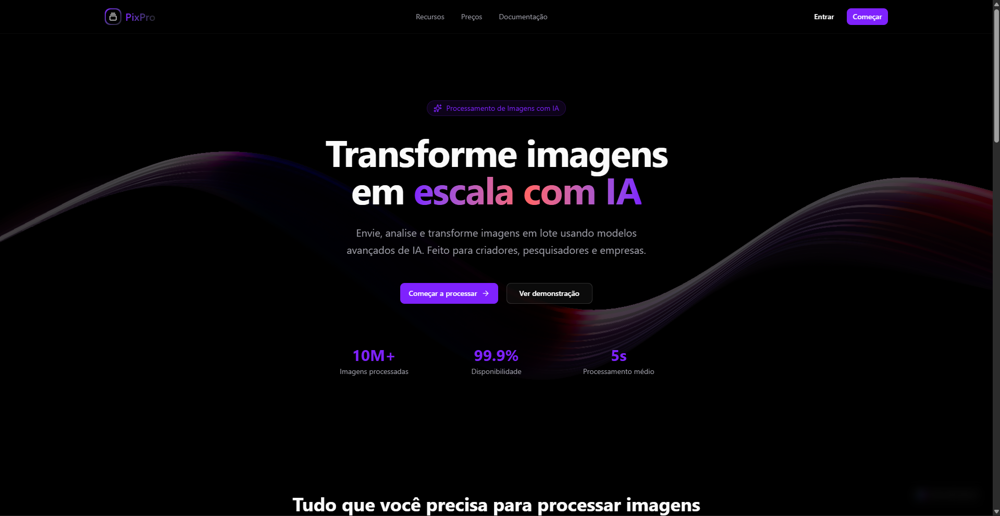
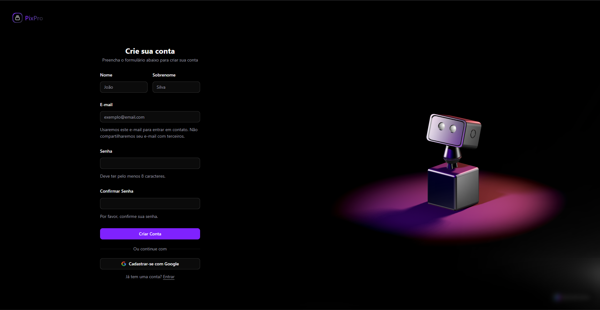

# PixPro - Plataforma de Processamento de Imagens com IA



## 📋 Sobre o Projeto

**PixPro** é uma plataforma moderna e intuitiva para processamento de imagens utilizando inteligência artificial. Desenvolvida com as tecnologias mais recentes do ecossistema React e Next.js, a aplicação oferece uma experiência completa para gerenciar, processar e transformar imagens com recursos avançados de IA.

### ✨ Funcionalidades Principais

- **🖼️ Gerenciamento de Projetos**: Crie e organize seus projetos de forma eficiente
- **🤖 Processamento com IA**:
  - Detecção de objetos com ajuste de confiança
  - Ampliação de imagens (upscaling) 2x ou 4x
  - Aplicação de filtros artísticos (Candy, Mosaic, Rain Princess, Udnie)
- **📤 Upload de Imagens**: Interface intuitiva para envio de múltiplas imagens
- **👤 Sistema de Autenticação**: Login e cadastro seguros
- **🎨 Interface Moderna**: Design responsivo com tema claro/escuro
- **📊 Dashboard Interativo**: Visualize e gerencie todos os seus projetos em um só lugar



## 🚀 Tecnologias Utilizadas

- **[Next.js 15.5.9](https://nextjs.org/)** - Framework React com renderização híbrida
- **[React 19.1.0](https://react.dev/)** - Biblioteca para construção de interfaces
- **[TypeScript](https://www.typescriptlang.org/)** - Tipagem estática para JavaScript
- **[Tailwind CSS 4](https://tailwindcss.com/)** - Framework CSS utilitário
- **[Shadcn/ui](https://ui.shadcn.com/)** - Componentes reutilizáveis e acessíveis
- **[Zustand](https://zustand-demo.pmnd.rs/)** - Gerenciamento de estado leve e eficiente
- **[Zod](https://zod.dev/)** - Validação de esquemas TypeScript-first
- **[Axios](https://axios-http.com/)** - Cliente HTTP para requisições à API
- **[Spline](https://spline.design/)** - Animações 3D interativas

## 📦 Pré-requisitos

Antes de começar, certifique-se de ter instalado em sua máquina:

- **Node.js** 20.x ou superior
- **npm**
- **Git**

## 🔧 Instalação e Configuração

### 1. Clone o repositório

```bash
git clone <url-do-repositorio>
cd pixpro-frontend
```

### 2. Instale as dependências

```bash
npm install
```

### 3. Configure as variáveis de ambiente

Crie um arquivo `.env.local` na raiz do projeto:

```env
NEXT_PUBLIC_API_URL=http://localhost:3001/api
NEXT_PUBLIC_CLOUDFLARE_R2_PUBLIC_DOMAIN="https://your-cloudflare-r2-domain.com"
NEXT_PUBLIC_CLOUDFLARE_R2_BUCKET_NAME="your-bucket-name"
```

### 4. Execute o projeto em modo de desenvolvimento

```bash
npm run dev
```

O projeto estará disponível em [http://localhost:3000](http://localhost:3000)

## 🐳 Executando com Docker

Se preferir utilizar Docker, execute:

```bash
npm run docker
```

ou

```bash
docker compose up -d
```

## 📝 Scripts Disponíveis

- `npm run dev` - Inicia o servidor de desenvolvimento com Turbopack
- `npm run build` - Gera a build de produção
- `npm run start` - Inicia o servidor de produção
- `npm run lint` - Executa o linter ESLint
- `npm run docker` - Inicia os containers Docker

## 🏗️ Estrutura do Projeto

```
pixpro-frontend/
├── public/              # Arquivos estáticos
├── src/
│   ├── @types/          # Definições de tipos TypeScript
│   ├── app/             # Rotas e páginas (App Router)
│   │   ├── dashboard/   # Área autenticada
│   │   ├── home/        # Página inicial
│   │   ├── login/       # Autenticação
│   │   └── signup/      # Cadastro
│   ├── components/      # Componentes reutilizáveis
│   │   └── ui/          # Componentes da biblioteca Shadcn
│   ├── config/          # Configurações da aplicação
│   ├── env/             # Variáveis de ambiente tipadas
│   ├── hooks/           # Hooks personalizados
│   ├── lib/             # Utilitários e configurações
│   ├── services/        # Camada de serviços/API
│   └── store/           # Gerenciamento de estado (Zustand)
├── images/              # Imagens para documentação
└── ...
```

## 🎯 Funcionalidades Detalhadas

### Gestão de Projetos

- Criação de novos projetos com nome, descrição e tema personalizado
- Visualização de todos os projetos em cards interativos
- Acesso rápido aos detalhes e imagens de cada projeto

### Processamento de Imagens

- **Detecção de Objetos**: Identifique objetos em suas imagens com controle de nível de confiança (0-100%)
- **Upscaling**: Aumente a resolução das imagens em 2x ou 4x mantendo a qualidade
- **Filtros Artísticos**: Aplique estilos artísticos únicos às suas imagens

### Interface do Usuário

- Design responsivo que se adapta a qualquer dispositivo
- Tema claro e escuro com alternância suave
- Navegação intuitiva com sidebar colapsável
- Feedback visual em tempo real para todas as ações

## 🔐 Segurança

O projeto implementa as melhores práticas de segurança:

- Autenticação baseada em tokens JWT
- Validação de dados com Zod
- Proteção de rotas autenticadas
- Sanitização de inputs
- Versão atualizada do Next.js (15.5.9) sem vulnerabilidades conhecidas

## 🤝 Contribuindo

Contribuições são sempre bem-vindas! Para contribuir:

1. Faça um Fork do projeto
2. Crie uma branch para sua feature (`git checkout -b feature/MinhaFeature`)
3. Commit suas mudanças (`git commit -m 'Adiciona MinhaFeature'`)
4. Push para a branch (`git push origin feature/MinhaFeature`)
5. Abra um Pull Request

## 📄 Licença

Este projeto está sob a licença MIT. Veja o arquivo `LICENSE` para mais detalhes.

## 👥 Autores

Desenvolvido por **FerreiiraTech**
